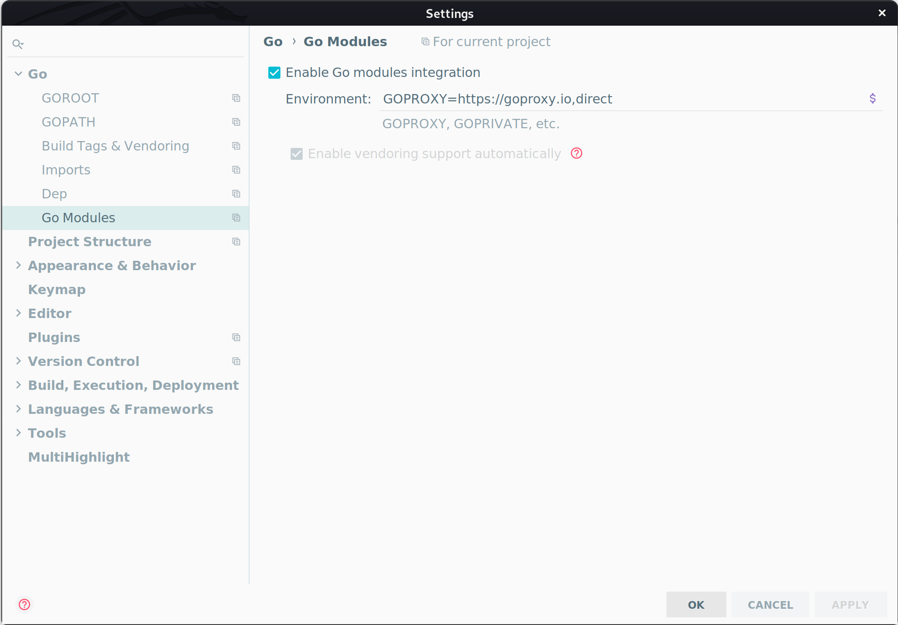
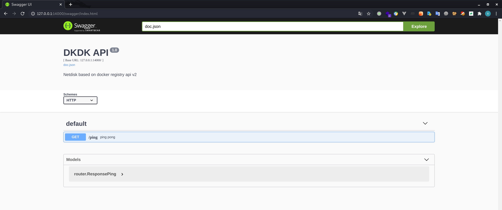

## 1. prepare
### 1.1 develop environment
* install golang: https://golang.org/doc/install
* install GoLand: https://www.jetbrains.com/go/download/#section=linux
* install docker: https://docs.docker.com/engine/install/ubuntu/

### 1.2 clone repository
```
git clone git@gitlab.com:st0n3/dkdk.git
```

### 1.3 open by GoLand
Open by GoLand, and then Enable Go Modules Integration

* tick Enable Go Modules Integration
* configure environment as `GOPROXY=https://goproxy.io,direct`



## 2. first run

run commands below.
```
cd dkdk
docker-compose up -d
```

and then access http://127.0.0.1:14000/swagger/index.html in browser, you will see:


